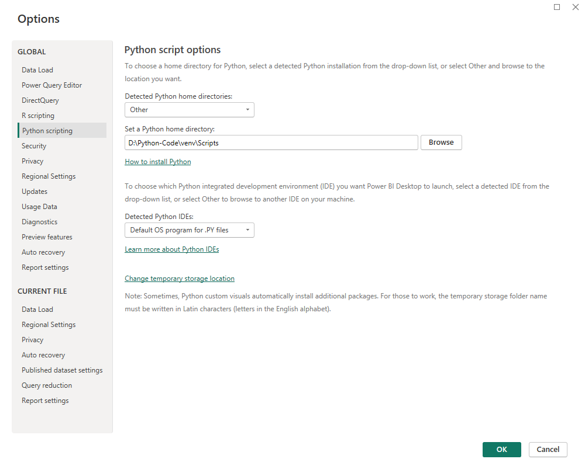
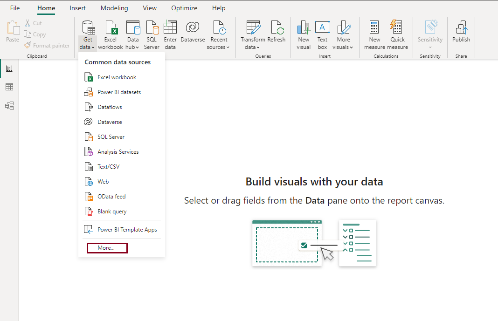
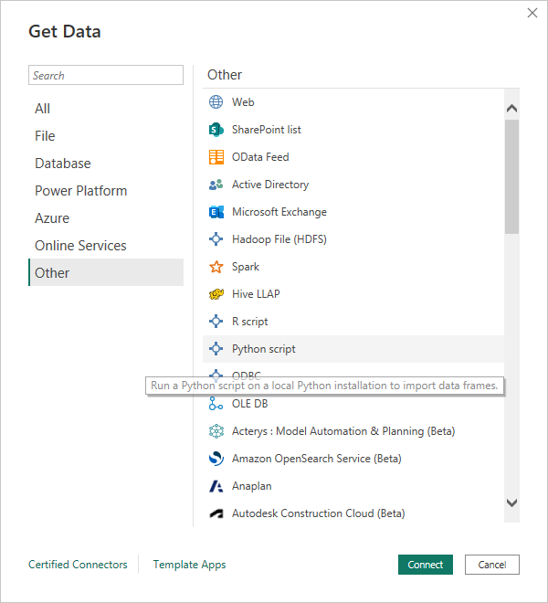
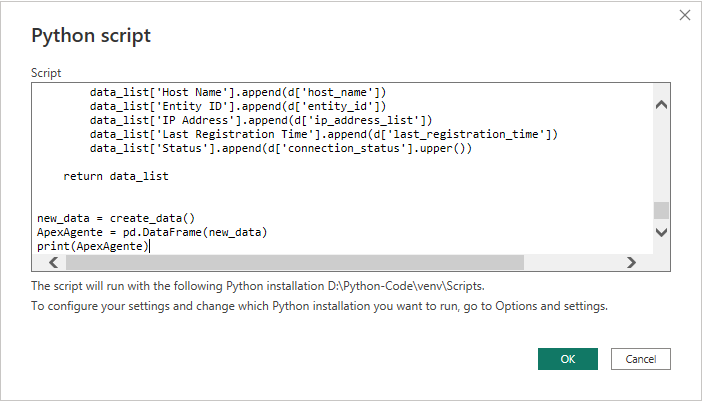
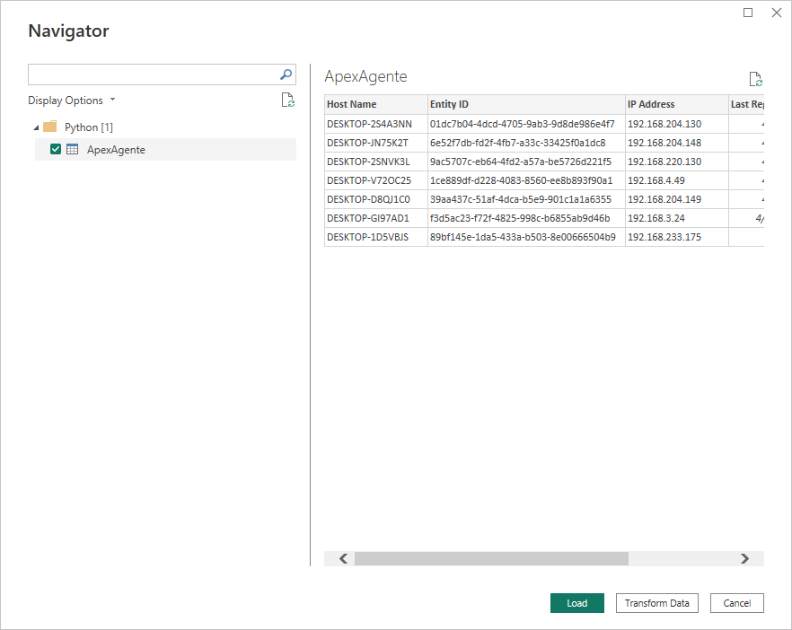

# Apex-Agente


<!-- LOGO -->
<br />
<h1>
<p align="center">
  
  <br>ApexAgente
</h1>
  <p align="center">
    Python application to check Apex agent in Trend Micro.
    <br />
    </p>
</p>
<p align="center">
  <a href="#about-the-project">About The Project</a> •
  <a href="#importing">Importing</a> •
  <a href="#installation">Installation</a> • 
  <a href = "#run-locally">Run Locally</a> •
  <a href="#run-on-microsoft-powerbi">Run on Microsoft PowerBI</a>
</p>

## About The Project

Apex Agente is a powerful Python application designed to gather data from Trend Micro Apex URL, a cloud-based security platform that provides advanced threat protection for enterprise networks. With Apex Agente, you can easily retrieve all available data from the Apex URL or retrieve specific data by hostname.

The first feature of Apex Agente allows you to retrieve all data from the Apex URL, giving you a comprehensive view of all datas available. This data can include information on host name, entity id, registration ip, and last registration time.

The second feature of Apex Agente allows you to retrieve data specific to a particular host name. This feature is particularly useful if you want to drill down into getting deeper information of a particular host or agent. With this feature, you can retrieve information on a host which included name, entity id, server id, registration ip, connection status, etc.

Apex Agente is easy to use and comes with a simple and intuitive user interface. It is designed to work with Trend Micro Apex URL, so you can be confident that the data you retrieve is accurate and up-to-date. Whether you are a security professional, network administrator, or IT manager, Apex Agente is a must-have tool for monitoring the security status of your network and ensuring that your organization stays safe from potential threats.

## Importing
To have the application, you need to import from github

``` bash
git clone https://github.com/AgentPython/Apex-Agente.git
```

## Installation

### Directory
Go to the cloned project by using:

``` bash
cd Apex-Agente
```

### Environmental <small>optional</small>

We recommend using a virtual environment, which is an isolated Python runtime. If you are in a virtual environment,
any package that you install or upgrade will be local to the environment. If you run into problem, you can just delete
and recreate the environment. It's trivial to set up:

- Create a new virtual environment
    ``` bash
    python -m venv venv
    ```

- Activate the environment with:
    - Linux / MacOS
        ``` bash
        . venv/bin/activate 
        ```
    - Windows
        ``` bash
        . venv/Scripts/activate
        ```

- Exit your virtual environment using:
    ``` bash
    deactivate
    ```

### Dependencies Installation
Apex-Agente has several dependencies that can be installed, ideally by using a virtual environment. Open up a terminal and install all dependencies with:
``` bash
pip install -r requirements.txt
```

This will automatically install compatible versions of all dependencies. Apex-Agente always strive to support the latest versions, so there's no need to install packages separately.

## Run Locally
To run it locally is pretty simple, just run it with:
``` bash
python -m main
```

> Note
>
> You can change the all data inside main.py file

## Run on Microsoft PowerBI
You can only run Python on Microsoft PowerBI on Windows.

### Enable Python scripting
To enable Python scripting in Power BI:

1. In Power BI Desktop, select **File** > **Options and settings** > **Options** > **Python scripting**. The **Python script options** page appears
2. On **Detected Python home directories**, replace it with the **Apex-Agente** directory and go to **venv** and choose **Scripts** (Ex: `D:\Apex-Agente\venv\Scripts`)
3. Select **OK.**



### Run the script and import data
To run your Python script:
1. In the **Home** group of the Power BI Desktop ribbon, select **Get data**.

2. In the **Get Data** dialog box, select **Other** > **Python script**, and then select **Connect**.

3. On the **Python script** screen, paste script on `main.py` into the **Script** field, and select **OK.**

4. If the script runs successfully, the **Navigator** window appears, and you can load the data. Select the **ApexAgente** table, and then select **Load.**

